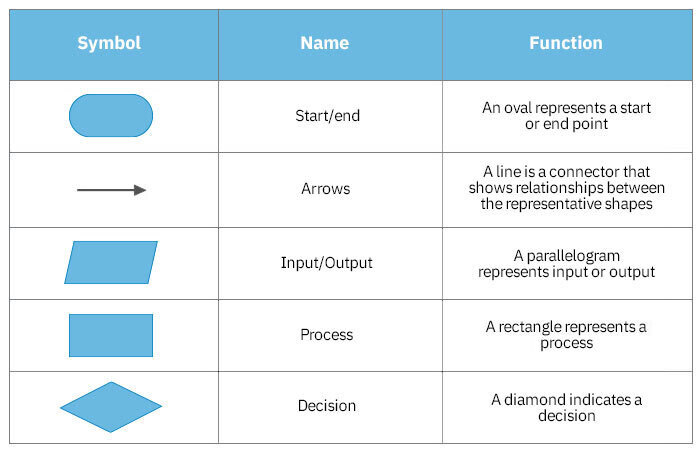
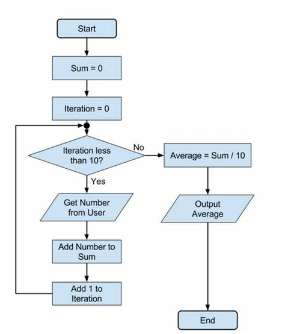

# Exam Details
Final on 4/29/25, 4pm-6pm on Tuesday

Exam topics: 
- Bubble sort without temporary variable
- function prototypes
- flowchart
- file IO
- composite data types: Enum, Struct, Union
- dynamic memory, static memory, ghost memory (memory leaks)
- pointer logic and pointer arithmetic
- swap without temporary variable

Sources: Slides 11-13, HW 6-9, ChatGPT.

# Bubble Sort
```c
void bubbleSort(int arr[], int n) {
    for (int i = 0; i < n-1; i++) {        // Number of passes
        for (int j = 0; j < n-i-1; j++) {   // Each pass
            if (arr[j] > arr[j+1]) {
                // Swap 
                int temp = arr[j];
                arr[j] = arr[j+1];
                arr[j+1] = temp;
            }
        }
    }
}
```
⚠️ Know how to do this without temporary variable (methods at the end of this file)


# Function Prototypes
```c
#include <stdio.h>

// Function prototype with parameter names
int multiply(int x, int y);

// Function prototype without parameter names
int sum(int, int);

int main() {
    printf("The product of 4 and 2 is: %d\n", multiply(4, 2));
    printf("The sum of 4 and 2 is: %d\n", sum(4, 2));
    return 0;
}

// Function definition
int multiply(int x, int y) {
    return x * y;
}

// Function definition
int sum(int a, int b) {
    return a + b;
}

```

# Flowchart
Symbol Meanings  


Example   


# File IO

Common File Modes

| Mode  | Meaning                             |
|-------|-------------------------------------|
| "r"   | Read (file must exist)              |
| "w"   | Write (overwrite/create new)        |
| "a"   | Append (write at end of file)        |
| "r+"  | Read + Write (no overwrite)          |
| "w+"  | Read + Write (overwrite/create new) |
| "a+"  | Read + Append                       |

<br></br>
Write to File Example
-
```c
#include <stdio.h>

int main() {
    FILE *fp = fopen("output.txt", "w"); // "w" = write mode
    if (fp == NULL) {
        printf("Error opening file!\n");
        return 1;
    }

    fprintf(fp, "Hello, world!\n");
    fprintf(fp, "Number: %d\n", 42);

    fclose(fp);
    return 0;
}
```
⚠️ Always check if `fopen` returned `NULL`
<br></br>          

Read from File Example
-
```c
#include <stdio.h>

int main() {
    FILE *fp = fopen("output.txt", "r");
    char buffer[100];

    if (fp == NULL) {
        printf("Error opening file!\n");
        return 1;
    }

    while (fgets(buffer, sizeof(buffer), fp) != NULL) {
        printf("%s", buffer); // print each line
    }

    fclose(fp);
    return 0;
}
```
<br></br>
# Composite Data Types: Union, Enum, Struct

`struct`: Allows you to store multiple variables of different types in a single object.

`union`: Allows you to store different types, but only one at a time (all members share the same memory space).

`enum`: Represents a set of named integer constants, making the code more readable.

<br></br>

Struct Example
-
```c
#include <stdio.h>

// Define the struct Person with age and height
struct Person {
    int age;    // Age of the person (integer)
    int height; // Height of the person in centimeters (integer)
};

int main() {
    // Declare and initialize a struct variable for a person
    struct Person bob = {25, 175};  // Age: 25, Height: 175 cm
    
    // Declare another struct variable for another person
    struct Person alex;
    
    // Assigning values to alex's members
    person2.age = 30;
    person2.height = 180;

    // Accessing and printing the members of alex
    printf("\nAlex's age: %d years\n", person2.age);
    printf("Alex's Height: %d cm\n", person2.height);

    // Accessing and printing the members of bob
    printf("Bob's Age: %d years\n", person1.age);
    printf("Bob's Height: %d cm\n", person1.height);

    return 0;
}
```


Union Example  
-
```c
#include <stdio.h>

// Define a union to store different types of data
union Data {
    int intValue;
    float floatValue;
    char charValue;
};

int main() {
    // Declare two variables of the same union type
    union Data data1, data2;

    // Assign an integer to data1
    data1.intValue = 42;
    printf("data1 (intValue): %d\n", data1.intValue);

    // Assign a float to data2 (this will overwrite the value in data2)
    data2.floatValue = 3.14;
    printf("data2 (floatValue): %.2f\n", data2.floatValue);

    // Now assign a character to data1 (this will overwrite the value in data1)
    data1.charValue = 'A';
    printf("data1 (charValue): %c\n", data1.charValue);

    // Print the values of data2 after modifying data1
    printf("data2 (after modifying data1): %.2f\n", data2.floatValue);

    return 0;
}

```

Enum Example  
-
```c
#include <stdio.h>

// Define an enum for gender
enum Gender {
    MALE=0,    // Automatically gets the value 0 if not specified then goes up
    FEMALE=1,    // Assigns the value 1
};

int main() {
    // Declare a variable of type enum Gender
    enum Gender bobsGender = MALE;

    switch (bobsGender) {
        case MALE: printf("Bro is a male"); break;
        case FEMALE: printf("Bro is a female"); break;
        default: printf("Ayo, bro is not a male or female");
    }

    return 0;
}
```


# Palindrome Checking Recursive
```c
#include <stdio.h>
#include <string.h>

// Recursive function to check palindrome
int isPalindrome(char str[], int start, int end) {
    // Base case: If start >= end, it's a palindrome
    if (start >= end)
        return 1; // True

    // If characters don't match, not a palindrome
    if (str[start] != str[end])
        return 0; // False

    // Move towards the center
    return isPalindrome(str, start + 1, end - 1);
}

int main() {
    char str[] = "racecar";

    int length = strlen(str);

    if (isPalindrome(str, 0, length - 1))
        printf("%s is a palindrome.\n", str);
    else
        printf("%s is NOT a palindrome.\n", str);

    return 0;
}
```

# Static Memory, Dynamic Memory, and Ghost Memory

```c
#include <stdio.h>
#include <stdlib.h>

// Static memory: global variable
int someStaticMemoryVar = 10;

int main() {
    // Static memory: local (stack) variable
    int localArray[5] = {1, 2, 3, 4, 5};

    // Dynamic memory: allocated at runtime
    int *dynamicArray = (int *)malloc(5 * sizeof(int));
    if (dynamicArray == NULL) {
        printf("Memory allocation failed!\n");
        return 1;
    }

    // Fill dynamic memory
    for (int i = 0; i < 5; i++) {
        dynamicArray[i] = i * 10;
    }

    // Simulate ghost memory: lose the pointer without freeing
    dynamicArray = NULL; // Now the memory is leaked (ghost memory)

    // Program continues...
    printf("Static variable: %d\n", staticVar);
    printf("Local array first element: %d\n", localArray[0]);

    // dynamicArray is NULL now, can't access dynamic memory anymore

    return 0;
}
```

# Pointer Logic: Pass by Reference vs Pass by Value, Pointer to Pointer.

Pass by Value
-
```c
#include <stdio.h>

void passByValue(int a) {
    a = a + 10;
    printf("[Inside function] a = %d\n", a);
}

int main() {
    int x = 5;
    passByValue(x);
    printf("[In main] x = %d\n", x); // x is still 5
    return 0;
}
```

Pass by Reference
-
```c
#include <stdio.h>

void passByReference(int *a) {
    *a = *a + 10; // Dereference to change actual value
    printf("[Inside function] *a = %d\n", *a);
}

int main() {
    int x = 5;
    passByReference(&x);
    printf("[In main] x = %d\n", x); // x is now 15
    return 0;
}
```

Pointer to another Pointer
-
```c
#include <stdio.h>

void modifyValue(int **p) {
    **p = 20; // Dereference twice to access real value
}

int main() {
    int x = 5;
    int *p = &x;
    int **pp = &p;

    modifyValue(pp);

    printf("x = %d\n", x); // Now x = 20
    return 0;
}

```

# Pointer Arithmetic
```c
#include <stdio.h>

int main() {
    int arr[] = {10, 20, 30, 40, 50};
    int *ptr = arr; // Pointer points to the first element (arr[0])

    printf("First element: %d\n", *ptr);        // 10
    printf("Second element: %d\n", *(ptr + 1)); // 20
    printf("Third element: %d\n", *(ptr + 2));  // 30

    // Move the pointer itself
    ptr++;  // Now ptr points to arr[1]
    printf("After ptr++, now points to: %d\n", *ptr); // 20

    ptr += 2; // Move 2 elements forward (now ptr points to arr[3])
    printf("After ptr += 2, now points to: %d\n", *ptr); // 40

    ptr--; // Move 1 element back (now ptr points to arr[2])
    printf("After ptr--, now points to: %d\n", *ptr); // 30

    return 0;
}
```

# Swap Array Elements without Temporary Variable

Addition/subtraction method
-
```c
#include <stdio.h>

int main() {
    int arr[] = {10, 20, 30, 40};
    int i = 1, j = 3; // Swap elements at index 1 and 3

    printf("Before swap: arr[%d] = %d, arr[%d] = %d\n", i, arr[i], j, arr[j]);

    arr[i] = arr[i] + arr[j]; // arr[1] = 20 + 40 = 60
    arr[j] = arr[i] - arr[j]; // arr[3] = 60 - 40 = 20
    arr[i] = arr[i] - arr[j]; // arr[1] = 60 - 20 = 40

    printf("After swap: arr[%d] = %d, arr[%d] = %d\n", i, arr[i], j, arr[j]);

    return 0;
}
```
⚠️Can cause overflow if numbers are very large.

Bitwise XOR method
-
```c
#include <stdio.h>

int main() {
    int arr[] = {10, 20, 30, 40};
    int i = 1, j = 3; // Swap elements at index 1 and 3

    printf("Before swap: arr[%d] = %d, arr[%d] = %d\n", i, arr[i], j, arr[j]);

    arr[i] = arr[i] ^ arr[j]; // XOR swap step 1
    arr[j] = arr[i] ^ arr[j]; // XOR swap step 2
    arr[i] = arr[i] ^ arr[j]; // XOR swap step 3

    printf("After swap: arr[%d] = %d, arr[%d] = %d\n", i, arr[i], j, arr[j]);

    return 0;
}
```
⚠️Only works with integer types